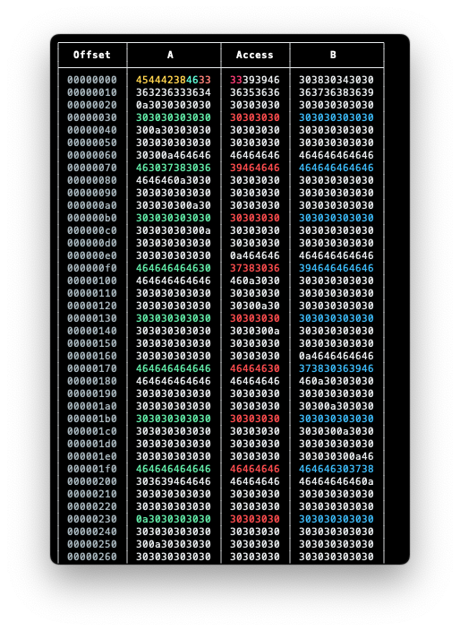
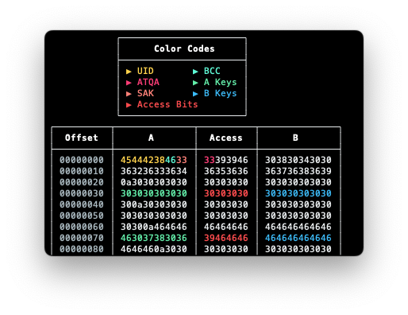

Golang utility to pretty print Mifare dump, both `1k` and `4k`.

Based on the mighty [`mfdread`](https://github.com/zhovner/mfdread).

## Usage

```sh
$> gofare -dump MifareDump.bin
```



To get the color codes:

```sh
$> gofare -dump MifareDump.bin -v
```


